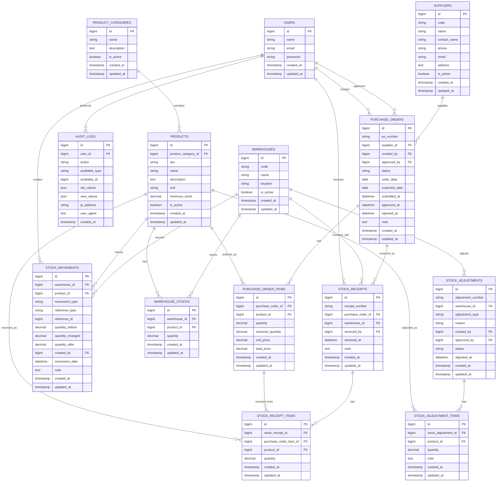

# StockFlow - Inventory & Purchase Management System

## 0.1 Project Summary

**StockFlow** คือระบบจัดการคลังสินค้าและการสั่งซื้อ สำหรับจำลองระบบงานจริงในบริษัทไทย เหมาะสำหรับใช้เป็น Portfolio Project เพื่อแสดงความสามารถด้าน Laravel, Vue, Inertia, Database Design, Workflow และระบบ Role-based Access Control

ระบบนี้เน้น workflow หลักของงานจัดซื้อและคลังสินค้า เช่น การสร้าง Purchase Order, การอนุมัติ PO, การรับสินค้าเข้าคลัง, การบันทึก Stock Movement และการตรวจสอบประวัติการเปลี่ยนแปลงของ stock

## 0.2 Tech Stack

* Laravel 12
* Vue 3
* Inertia.js
* Tailwind CSS
* MySQL
* Laravel Breeze Vue + Inertia
* Spatie Permission ใช้ใน phase หลังจาก setup project เสร็จ
* Excel / CSV / PDF Export ใช้ใน phase รายงาน

## 0.3 MVP Scope

MVP แรกควรทำให้ระบบ “เดิน flow งานหลักได้จริง” ก่อน ไม่ต้องทำทุก feature ใหญ่ตั้งแต่ต้น

### MVP Features

1. Authentication
2. Dashboard พื้นฐาน
3. Product Management
4. Supplier Management
5. Warehouse Management
6. Purchase Order Workflow
7. Receive Stock
8. Stock Movement History
9. Low Stock Alert แบบพื้นฐาน
10. Audit Log แบบพื้นฐาน

### Features ที่เก็บไว้ต่อยอด

1. Role Permission แบบละเอียดด้วย Spatie Permission
2. Stock Adjustment
3. Reports
4. CSV / Excel / PDF Export
5. Advanced Dashboard
6. Search / Filter / Sort แบบละเอียด
7. Notification
8. Activity timeline แบบสวยงาม

## 0.4 Roles

### ADMIN

ดูแลระบบทั้งหมด เช่น users, master data, product, warehouse, supplier และสามารถเข้าถึงทุก module

### PURCHASING

ดูแลเรื่องการสั่งซื้อสินค้า

หน้าที่หลัก:

* สร้าง Purchase Order
* แก้ไข PO ตอนยังเป็น Draft
* Submit PO เพื่อรออนุมัติ
* ดูสถานะ PO

### MANAGER

ดูแลการอนุมัติ Purchase Order

หน้าที่หลัก:

* ดู PO ที่รออนุมัติ
* Approve PO
* Reject PO
* ดูรายงานภาพรวม

### WAREHOUSE

ดูแลคลังสินค้าและการรับสินค้า

หน้าที่หลัก:

* ดู PO ที่ Approved แล้ว
* รับสินค้าเข้าคลัง
* ตรวจสอบ Stock
* ดู Stock Movement
* ทำ Stock Adjustment ใน phase ถัดไป

## 0.5 Core Workflow

Workflow หลักของระบบคือ Purchase Order → Approval → Receive Stock → Stock Movement

```text
Purchasing creates Purchase Order
↓
PO status = DRAFT
↓
Purchasing submits PO
↓
PO status = PENDING_APPROVAL
↓
Manager approves PO
↓
PO status = APPROVED
↓
Warehouse receives stock
↓
Stock quantity increases
↓
Create stock movement type = RECEIVE
↓
PO status = PARTIALLY_RECEIVED or COMPLETED
```

## 0.6 Purchase Order Status

ใช้เป็น string status ก่อน เพื่อให้ง่ายกับ migration และต่อยอดภายหลัง

```text
DRAFT
PENDING_APPROVAL
APPROVED
REJECTED
PARTIALLY_RECEIVED
COMPLETED
CANCELLED
```

### ความหมายของ status

* `DRAFT` = PO ยังแก้ไขได้
* `PENDING_APPROVAL` = ส่งให้ Manager รออนุมัติ
* `APPROVED` = Manager อนุมัติแล้ว รอรับสินค้า
* `REJECTED` = Manager ไม่อนุมัติ
* `PARTIALLY_RECEIVED` = รับสินค้าแล้วบางส่วน
* `COMPLETED` = รับสินค้าครบแล้ว
* `CANCELLED` = ยกเลิก PO

## 0.7 Main Entities

### User

ผู้ใช้งานระบบ เช่น admin, purchasing, manager, warehouse

### Product Category

หมวดหมู่สินค้า เช่น Office Supplies, IT Equipment, Raw Material

### Product

ข้อมูลสินค้า เช่น SKU, ชื่อสินค้า, หน่วยนับ, จุดสั่งซื้อขั้นต่ำ

### Supplier

ข้อมูลผู้ขาย / vendor

### Warehouse

ข้อมูลคลังสินค้า

### Warehouse Stock

ยอดคงเหลือของสินค้าแต่ละตัวในแต่ละคลัง

### Purchase Order

เอกสารสั่งซื้อสินค้า

### Purchase Order Item

รายการสินค้าใน PO

### Stock Receipt

เอกสารรับสินค้าเข้าคลัง อ้างอิงจาก Purchase Order

### Stock Receipt Item

รายการสินค้าที่รับเข้าคลัง

### Stock Movement

ประวัติการเคลื่อนไหว stock ทุกครั้ง

### Stock Adjustment

เอกสารปรับยอด stock

### Stock Adjustment Item

รายการสินค้าที่ถูกปรับยอด

### Audit Log

ประวัติการทำงานสำคัญ เช่น สร้าง PO, approve PO, receive stock

## 0.8 Database Schema Plan

### users

Laravel Breeze จะสร้าง table นี้ให้อยู่แล้ว

เพิ่ม field ภายหลังได้ถ้าจำเป็น เช่น:

| Column     | Type       | Note                   |
| ---------- | ---------- | ---------------------- |
| id         | bigint     | primary key            |
| name       | string     | user full name         |
| email      | string     | unique                 |
| password   | string     | hashed password        |
| timestamps | timestamps | created_at, updated_at |

Role จะยังไม่ custom เองใน MVP แรก เพราะจะใช้ Spatie Permission ภายหลัง

---

### product_categories

| Column      | Type          | Note                   |
| ----------- | ------------- | ---------------------- |
| id          | bigint        | primary key            |
| name        | string        | category name          |
| description | text nullable | category detail        |
| is_active   | boolean       | default true           |
| timestamps  | timestamps    | created_at, updated_at |

Relationship:

* product_categories has many products

---

### products

| Column              | Type               | Note                          |
| ------------------- | ------------------ | ----------------------------- |
| id                  | bigint             | primary key                   |
| product_category_id | foreignId nullable | references product_categories |
| sku                 | string             | unique                        |
| name                | string             | product name                  |
| description         | text nullable      | product detail                |
| unit                | string             | example: pcs, box, kg         |
| minimum_stock       | decimal(12,2)      | low stock threshold           |
| is_active           | boolean            | default true                  |
| timestamps          | timestamps         | created_at, updated_at        |
| softDeletes         | soft deletes       | optional but recommended      |

Relationship:

* product belongs to product_category
* product has many purchase_order_items
* product has many warehouse_stocks
* product has many stock_movements

---

### suppliers

| Column       | Type            | Note                     |
| ------------ | --------------- | ------------------------ |
| id           | bigint          | primary key              |
| code         | string nullable | supplier code            |
| name         | string          | supplier name            |
| contact_name | string nullable | contact person           |
| phone        | string nullable | phone number             |
| email        | string nullable | email                    |
| address      | text nullable   | supplier address         |
| is_active    | boolean         | default true             |
| timestamps   | timestamps      | created_at, updated_at   |
| softDeletes  | soft deletes    | optional but recommended |

Relationship:

* supplier has many purchase_orders

---

### warehouses

| Column      | Type            | Note                     |
| ----------- | --------------- | ------------------------ |
| id          | bigint          | primary key              |
| code        | string          | unique                   |
| name        | string          | warehouse name           |
| location    | string nullable | warehouse location       |
| is_active   | boolean         | default true             |
| timestamps  | timestamps      | created_at, updated_at   |
| softDeletes | soft deletes    | optional but recommended |

Relationship:

* warehouse has many warehouse_stocks
* warehouse has many stock_receipts
* warehouse has many stock_movements

---

### warehouse_stocks

เก็บยอด stock ปัจจุบันของสินค้าแต่ละตัวในแต่ละคลัง

| Column       | Type          | Note                   |
| ------------ | ------------- | ---------------------- |
| id           | bigint        | primary key            |
| warehouse_id | foreignId     | references warehouses  |
| product_id   | foreignId     | references products    |
| quantity     | decimal(12,2) | current stock          |
| timestamps   | timestamps    | created_at, updated_at |

Important constraint:

* unique by `warehouse_id` + `product_id`

Relationship:

* warehouse_stock belongs to warehouse
* warehouse_stock belongs to product

Rule สำคัญ:

```text
ถ้า warehouse_stocks.quantity เปลี่ยน ต้องมี stock_movements เสมอ
```

---

### purchase_orders

| Column        | Type               | Note                     |
| ------------- | ------------------ | ------------------------ |
| id            | bigint             | primary key              |
| po_number     | string             | unique                   |
| supplier_id   | foreignId          | references suppliers     |
| created_by    | foreignId          | references users         |
| approved_by   | foreignId nullable | references users         |
| status        | string             | default DRAFT            |
| order_date    | date               | PO date                  |
| expected_date | date nullable      | expected delivery date   |
| submitted_at  | datetime nullable  | submit timestamp         |
| approved_at   | datetime nullable  | approve timestamp        |
| rejected_at   | datetime nullable  | reject timestamp         |
| note          | text nullable      | note                     |
| timestamps    | timestamps         | created_at, updated_at   |
| softDeletes   | soft deletes       | optional but recommended |

Relationship:

* purchase_order belongs to supplier
* purchase_order belongs to created_by user
* purchase_order belongs to approved_by user
* purchase_order has many purchase_order_items
* purchase_order has many stock_receipts

---

### purchase_order_items

| Column            | Type          | Note                       |
| ----------------- | ------------- | -------------------------- |
| id                | bigint        | primary key                |
| purchase_order_id | foreignId     | references purchase_orders |
| product_id        | foreignId     | references products        |
| quantity          | decimal(12,2) | ordered quantity           |
| received_quantity | decimal(12,2) | default 0                  |
| unit_price        | decimal(12,2) | price per unit             |
| total_price       | decimal(12,2) | quantity * unit_price      |
| timestamps        | timestamps    | created_at, updated_at     |

Relationship:

* purchase_order_item belongs to purchase_order
* purchase_order_item belongs to product

Important rule:

```text
received_quantity ห้ามมากกว่า quantity
```

---

### stock_receipts

เอกสารรับสินค้าเข้าคลัง อ้างอิงจาก PO

| Column            | Type          | Note                       |
| ----------------- | ------------- | -------------------------- |
| id                | bigint        | primary key                |
| receipt_number    | string        | unique                     |
| purchase_order_id | foreignId     | references purchase_orders |
| warehouse_id      | foreignId     | references warehouses      |
| received_by       | foreignId     | references users           |
| received_at       | datetime      | receive datetime           |
| note              | text nullable | note                       |
| timestamps        | timestamps    | created_at, updated_at     |

Relationship:

* stock_receipt belongs to purchase_order
* stock_receipt belongs to warehouse
* stock_receipt belongs to received_by user
* stock_receipt has many stock_receipt_items

---

### stock_receipt_items

| Column                 | Type          | Note                            |
| ---------------------- | ------------- | ------------------------------- |
| id                     | bigint        | primary key                     |
| stock_receipt_id       | foreignId     | references stock_receipts       |
| purchase_order_item_id | foreignId     | references purchase_order_items |
| product_id             | foreignId     | references products             |
| quantity               | decimal(12,2) | received quantity               |
| timestamps             | timestamps    | created_at, updated_at          |

Relationship:

* stock_receipt_item belongs to stock_receipt
* stock_receipt_item belongs to purchase_order_item
* stock_receipt_item belongs to product

---

### stock_movements

เก็บประวัติการเปลี่ยนแปลง stock ทุกครั้ง

| Column           | Type            | Note                                   |
| ---------------- | --------------- | -------------------------------------- |
| id               | bigint          | primary key                            |
| warehouse_id     | foreignId       | references warehouses                  |
| product_id       | foreignId       | references products                    |
| movement_type    | string          | RECEIVE, ADJUST_IN, ADJUST_OUT         |
| reference_type   | string nullable | example: StockReceipt, StockAdjustment |
| reference_id     | bigint nullable | id ของเอกสารอ้างอิง                    |
| quantity_before  | decimal(12,2)   | stock before movement                  |
| quantity_changed | decimal(12,2)   | plus or minus quantity                 |
| quantity_after   | decimal(12,2)   | stock after movement                   |
| created_by       | foreignId       | references users                       |
| movement_date    | datetime        | movement datetime                      |
| note             | text nullable   | note                                   |
| timestamps       | timestamps      | created_at, updated_at                 |

Important rule:

```text
stock_movements เป็น source of history
warehouse_stocks เป็น current balance
```

---

### stock_adjustments

ใช้สำหรับปรับยอด stock เช่น นับสต็อกแล้วขาด / เกิน

| Column            | Type               | Note                       |
| ----------------- | ------------------ | -------------------------- |
| id                | bigint             | primary key                |
| adjustment_number | string             | unique                     |
| warehouse_id      | foreignId          | references warehouses      |
| adjustment_type   | string             | INCREASE, DECREASE         |
| reason            | string nullable    | reason                     |
| created_by        | foreignId          | references users           |
| approved_by       | foreignId nullable | references users           |
| status            | string             | DRAFT, APPROVED, CANCELLED |
| adjusted_at       | datetime nullable  | adjustment datetime        |
| timestamps        | timestamps         | created_at, updated_at     |

Phase แรกอาจยังไม่ต้องทำ adjustment approval ซับซ้อน ให้ทำทีหลังได้

---

### stock_adjustment_items

| Column              | Type          | Note                         |
| ------------------- | ------------- | ---------------------------- |
| id                  | bigint        | primary key                  |
| stock_adjustment_id | foreignId     | references stock_adjustments |
| product_id          | foreignId     | references products          |
| quantity            | decimal(12,2) | adjusted quantity            |
| note                | text nullable | item note                    |
| timestamps          | timestamps    | created_at, updated_at       |

---

### audit_logs

เก็บ log การทำงานสำคัญในระบบ

| Column         | Type               | Note                             |
| -------------- | ------------------ | -------------------------------- |
| id             | bigint             | primary key                      |
| user_id        | foreignId nullable | references users                 |
| action         | string             | example: PO_CREATED, PO_APPROVED |
| auditable_type | string nullable    | model class                      |
| auditable_id   | bigint nullable    | model id                         |
| old_values     | json nullable      | before update                    |
| new_values     | json nullable      | after update                     |
| ip_address     | string nullable    | request ip                       |
| user_agent     | text nullable      | browser info                     |
| created_at     | timestamp          | log created time                 |

MVP แรกอาจทำแบบ manual log ก่อน เช่น ตอน create PO, submit PO, approve PO, receive stock

## 0.9 ERD Relationship Summary

```text
users
  ├── has many purchase_orders as created_by
  ├── has many purchase_orders as approved_by
  ├── has many stock_receipts as received_by
  └── has many stock_movements as created_by

product_categories
  └── has many products

products
  ├── belongs to product_categories
  ├── has many warehouse_stocks
  ├── has many purchase_order_items
  ├── has many stock_receipt_items
  ├── has many stock_movements
  └── has many stock_adjustment_items

suppliers
  └── has many purchase_orders

warehouses
  ├── has many warehouse_stocks
  ├── has many stock_receipts
  ├── has many stock_movements
  └── has many stock_adjustments

purchase_orders
  ├── belongs to suppliers
  ├── belongs to users as created_by
  ├── belongs to users as approved_by
  ├── has many purchase_order_items
  └── has many stock_receipts

purchase_order_items
  ├── belongs to purchase_orders
  ├── belongs to products
  └── has many stock_receipt_items

stock_receipts
  ├── belongs to purchase_orders
  ├── belongs to warehouses
  ├── belongs to users as received_by
  └── has many stock_receipt_items

stock_movements
  ├── belongs to warehouses
  ├── belongs to products
  └── belongs to users as created_by
```

## 0.10 Mermaid ERD for README



## 0.11 Route Plan

ใช้ Laravel Web Routes + Inertia Pages เป็นหลัก

### Auth Routes

Breeze จะจัดการให้ เช่น:

```text
GET /login
POST /login
POST /logout
GET /register
POST /register
```

ใน portfolio จริง อาจปิด register ภายหลัง แล้วใช้ seed user แทน

---

### Dashboard

```text
GET /dashboard
```

Controller:

```text
DashboardController@index
```

Inertia Page:

```text
Dashboard/Index.vue
```

---

### Product Categories

```text
GET    /product-categories
GET    /product-categories/create
POST   /product-categories
GET    /product-categories/{productCategory}/edit
PUT    /product-categories/{productCategory}
DELETE /product-categories/{productCategory}
```

Controller:

```text
ProductCategoryController
```

Inertia Pages:

```text
ProductCategories/Index.vue
ProductCategories/Create.vue
ProductCategories/Edit.vue
```

---

### Products

```text
GET    /products
GET    /products/create
POST   /products
GET    /products/{product}
GET    /products/{product}/edit
PUT    /products/{product}
DELETE /products/{product}
```

Controller:

```text
ProductController
```

Inertia Pages:

```text
Products/Index.vue
Products/Create.vue
Products/Edit.vue
Products/Show.vue
```

---

### Suppliers

```text
GET    /suppliers
GET    /suppliers/create
POST   /suppliers
GET    /suppliers/{supplier}
GET    /suppliers/{supplier}/edit
PUT    /suppliers/{supplier}
DELETE /suppliers/{supplier}
```

Controller:

```text
SupplierController
```

Inertia Pages:

```text
Suppliers/Index.vue
Suppliers/Create.vue
Suppliers/Edit.vue
Suppliers/Show.vue
```

---

### Warehouses

```text
GET    /warehouses
GET    /warehouses/create
POST   /warehouses
GET    /warehouses/{warehouse}
GET    /warehouses/{warehouse}/edit
PUT    /warehouses/{warehouse}
DELETE /warehouses/{warehouse}
```

Controller:

```text
WarehouseController
```

Inertia Pages:

```text
Warehouses/Index.vue
Warehouses/Create.vue
Warehouses/Edit.vue
Warehouses/Show.vue
```

---

### Purchase Orders

```text
GET    /purchase-orders
GET    /purchase-orders/create
POST   /purchase-orders
GET    /purchase-orders/{purchaseOrder}
GET    /purchase-orders/{purchaseOrder}/edit
PUT    /purchase-orders/{purchaseOrder}
DELETE /purchase-orders/{purchaseOrder}

POST   /purchase-orders/{purchaseOrder}/submit
POST   /purchase-orders/{purchaseOrder}/approve
POST   /purchase-orders/{purchaseOrder}/reject
POST   /purchase-orders/{purchaseOrder}/cancel
```

Controller:

```text
PurchaseOrderController
PurchaseOrderActionController
```

Inertia Pages:

```text
PurchaseOrders/Index.vue
PurchaseOrders/Create.vue
PurchaseOrders/Edit.vue
PurchaseOrders/Show.vue
```

Best practice:

* CRUD หลักอยู่ใน `PurchaseOrderController`
* Action เฉพาะ workflow เช่น submit, approve, reject, cancel แยกไป `PurchaseOrderActionController`

---

### Stock Receipts

```text
GET  /stock-receipts
GET  /stock-receipts/create
POST /stock-receipts
GET  /stock-receipts/{stockReceipt}
```

หรือรับของจาก PO โดยตรง:

```text
GET  /purchase-orders/{purchaseOrder}/receive
POST /purchase-orders/{purchaseOrder}/receive
```

Controller:

```text
StockReceiptController
```

Inertia Pages:

```text
StockReceipts/Index.vue
StockReceipts/Create.vue
StockReceipts/Show.vue
```

---

### Stock Movements

```text
GET /stock-movements
GET /stock-movements/{stockMovement}
```

Controller:

```text
StockMovementController
```

Inertia Pages:

```text
StockMovements/Index.vue
StockMovements/Show.vue
```

---

### Stock Adjustments

ทำหลัง MVP หลักเริ่มนิ่ง

```text
GET  /stock-adjustments
GET  /stock-adjustments/create
POST /stock-adjustments
GET  /stock-adjustments/{stockAdjustment}
POST /stock-adjustments/{stockAdjustment}/approve
POST /stock-adjustments/{stockAdjustment}/cancel
```

Controller:

```text
StockAdjustmentController
StockAdjustmentActionController
```

Inertia Pages:

```text
StockAdjustments/Index.vue
StockAdjustments/Create.vue
StockAdjustments/Show.vue
```

---

### Reports

ทำหลัง workflow หลักเสร็จ

```text
GET /reports/inventory-summary
GET /reports/low-stock
GET /reports/purchase-orders
GET /reports/stock-movements

GET /reports/inventory-summary/export
GET /reports/low-stock/export
GET /reports/purchase-orders/export
```

Controller:

```text
ReportController
```

Inertia Pages:

```text
Reports/InventorySummary.vue
Reports/LowStock.vue
Reports/PurchaseOrders.vue
Reports/StockMovements.vue
```

## 0.12 Laravel Folder Plan

```text
app/
├── Enums/
│   ├── PurchaseOrderStatus.php
│   ├── StockMovementType.php
│   └── StockAdjustmentStatus.php
│
├── Http/
│   ├── Controllers/
│   │   ├── DashboardController.php
│   │   ├── ProductCategoryController.php
│   │   ├── ProductController.php
│   │   ├── SupplierController.php
│   │   ├── WarehouseController.php
│   │   ├── PurchaseOrderController.php
│   │   ├── PurchaseOrderActionController.php
│   │   ├── StockReceiptController.php
│   │   ├── StockMovementController.php
│   │   ├── StockAdjustmentController.php
│   │   └── ReportController.php
│   │
│   └── Requests/
│       ├── Product/
│       │   ├── StoreProductRequest.php
│       │   └── UpdateProductRequest.php
│       ├── Supplier/
│       │   ├── StoreSupplierRequest.php
│       │   └── UpdateSupplierRequest.php
│       ├── Warehouse/
│       │   ├── StoreWarehouseRequest.php
│       │   └── UpdateWarehouseRequest.php
│       ├── PurchaseOrder/
│       │   ├── StorePurchaseOrderRequest.php
│       │   └── UpdatePurchaseOrderRequest.php
│       └── StockReceipt/
│           └── StoreStockReceiptRequest.php
│
├── Models/
│   ├── ProductCategory.php
│   ├── Product.php
│   ├── Supplier.php
│   ├── Warehouse.php
│   ├── WarehouseStock.php
│   ├── PurchaseOrder.php
│   ├── PurchaseOrderItem.php
│   ├── StockReceipt.php
│   ├── StockReceiptItem.php
│   ├── StockMovement.php
│   ├── StockAdjustment.php
│   ├── StockAdjustmentItem.php
│   └── AuditLog.php
│
├── Services/
│   ├── PurchaseOrderService.php
│   ├── StockReceiptService.php
│   ├── StockMovementService.php
│   ├── StockAdjustmentService.php
│   └── AuditLogService.php
│
└── Policies/
    ├── ProductPolicy.php
    ├── PurchaseOrderPolicy.php
    ├── StockReceiptPolicy.php
    └── StockAdjustmentPolicy.php
```

หมายเหตุ:

* `Enums` ใช้เก็บ status/type ให้ code อ่านง่าย
* `Requests` ใช้ validate form แยกจาก controller
* `Services` ใช้เก็บ business logic สำคัญ เช่น receive stock, create movement
* `Policies` ค่อยเพิ่มจริงหลังเริ่มทำ Role Permission

## 0.13 Vue / Inertia Folder Plan

```text
resources/js/
├── Components/
│   ├── App/
│   │   ├── AppLayout.vue
│   │   ├── Sidebar.vue
│   │   ├── Navbar.vue
│   │   └── PageHeader.vue
│   │
│   ├── Form/
│   │   ├── TextInput.vue
│   │   ├── SelectInput.vue
│   │   ├── TextareaInput.vue
│   │   └── InputError.vue
│   │
│   ├── Table/
│   │   ├── DataTable.vue
│   │   └── Pagination.vue
│   │
│   └── UI/
│       ├── Badge.vue
│       ├── Button.vue
│       └── Card.vue
│
├── Layouts/
│   ├── AuthenticatedLayout.vue
│   └── GuestLayout.vue
│
├── Pages/
│   ├── Dashboard/
│   │   └── Index.vue
│   │
│   ├── ProductCategories/
│   │   ├── Index.vue
│   │   ├── Create.vue
│   │   └── Edit.vue
│   │
│   ├── Products/
│   │   ├── Index.vue
│   │   ├── Create.vue
│   │   ├── Edit.vue
│   │   └── Show.vue
│   │
│   ├── Suppliers/
│   │   ├── Index.vue
│   │   ├── Create.vue
│   │   ├── Edit.vue
│   │   └── Show.vue
│   │
│   ├── Warehouses/
│   │   ├── Index.vue
│   │   ├── Create.vue
│   │   ├── Edit.vue
│   │   └── Show.vue
│   │
│   ├── PurchaseOrders/
│   │   ├── Index.vue
│   │   ├── Create.vue
│   │   ├── Edit.vue
│   │   └── Show.vue
│   │
│   ├── StockReceipts/
│   │   ├── Index.vue
│   │   ├── Create.vue
│   │   └── Show.vue
│   │
│   ├── StockMovements/
│   │   ├── Index.vue
│   │   └── Show.vue
│   │
│   ├── StockAdjustments/
│   │   ├── Index.vue
│   │   ├── Create.vue
│   │   └── Show.vue
│   │
│   └── Reports/
│       ├── InventorySummary.vue
│       ├── LowStock.vue
│       ├── PurchaseOrders.vue
│       └── StockMovements.vue
│
├── Composables/
│   ├── useFormatDate.js
│   ├── useFormatMoney.js
│   └── useStatusBadge.js
│
└── app.js
```

## 0.14 Development Roadmap

### Step 0: Requirement & ERD

Goal:

* วาง scope
* ออกแบบ schema
* วาง workflow
* วาง route plan
* วาง folder plan
* เตรียม README plan

Commit:

```text
docs: add StockFlow requirement and ERD plan
```

---

### Step 1: Project Setup

Goal:

* Create Laravel 12 project
* Setup MySQL `.env`
* Install Breeze Vue + Inertia
* Run migration
* Setup Git repo
* First commit

Commit:

```text
chore: setup Laravel Breeze with Vue and Inertia
```

---

### Step 2: Base Layout

Goal:

* ปรับ layout หลัง login
* เพิ่ม sidebar / navbar
* เพิ่มเมนูหลัก
* ทำ Dashboard หน้าเปล่า

Commit:

```text
feat: add authenticated app layout and navigation
```

---

### Step 3: Master Data - Product Categories

Goal:

* CRUD product categories
* Validation
* Flash message
* Basic table

Commit:

```text
feat: add product category management
```

---

### Step 4: Master Data - Products

Goal:

* CRUD products
* เลือก category
* กำหนด SKU, unit, minimum_stock
* Search product

Commit:

```text
feat: add product management
```

---

### Step 5: Master Data - Suppliers

Goal:

* CRUD suppliers
* Supplier detail page

Commit:

```text
feat: add supplier management
```

---

### Step 6: Master Data - Warehouses

Goal:

* CRUD warehouses
* Prepare warehouse stock relation

Commit:

```text
feat: add warehouse management
```

---

### Step 7: Purchase Order Basic CRUD

Goal:

* Create PO
* Add PO items
* Calculate total
* Status default DRAFT
* Show PO detail

Commit:

```text
feat: add purchase order draft workflow
```

---

### Step 8: Purchase Order Approval Workflow

Goal:

* Submit PO
* Approve PO
* Reject PO
* Update status
* Add timestamps

Commit:

```text
feat: add purchase order approval workflow
```

---

### Step 9: Receive Stock

Goal:

* Warehouse receive stock from approved PO
* Validate receive quantity
* Update received_quantity
* Update PO status

Commit:

```text
feat: add stock receiving from purchase orders
```

---

### Step 10: Stock Movement

Goal:

* Create stock movement when receiving stock
* Update warehouse_stocks
* Show stock movement history

Commit:

```text
feat: record stock movements on stock receipt
```

---

### Step 11: Dashboard and Low Stock Alert

Goal:

* Total products
* Total suppliers
* Pending PO
* Low stock items
* Recent stock movements

Commit:

```text
feat: add inventory dashboard and low stock alert
```

---

### Step 12: Role Permission

Goal:

* Install Spatie Permission
* Seed roles
* Assign role to users
* Protect routes by role

Commit:

```text
feat: add role-based access control
```

---

### Step 13: Audit Log

Goal:

* Log important actions
* Show audit log list

Commit:

```text
feat: add audit logging for key system actions
```

---

### Step 14: Reports and Export

Goal:

* Inventory summary report
* Low stock report
* Purchase order report
* CSV / Excel export
* PDF export if needed

Commit:

```text
feat: add inventory and purchase reports
```

---

### Step 15: README and Portfolio Polish

Goal:

* Add screenshots
* Add demo account
* Add ERD
* Add feature list
* Add local setup guide

Commit:

```text
docs: update README with screenshots and setup guide
```

## 0.15 Best Practices

### Database

* ใช้ foreign key ให้ครบ
* ใช้ `decimal(12,2)` สำหรับ quantity และ price
* ใช้ unique constraint กับข้อมูลที่ไม่ควรซ้ำ เช่น `sku`, `po_number`, `warehouse code`
* `warehouse_stocks` ต้อง unique ด้วย `warehouse_id` + `product_id`
* การเปลี่ยน stock ต้องทำผ่าน service เท่านั้น
* ห้าม update `warehouse_stocks.quantity` ตรง ๆ ใน controller

### Business Logic

Logic สำคัญควรอยู่ใน Service เช่น:

```text
PurchaseOrderService
StockReceiptService
StockMovementService
```

ตัวอย่าง rule:

```text
Receive stock ต้องทำใน database transaction
Update warehouse_stocks และ create stock_movements ต้องสำเร็จพร้อมกัน
ถ้าอันใดอันหนึ่ง fail ต้อง rollback
```

### Controller

Controller ควรบางที่สุด

Controller มีหน้าที่:

* รับ request
* เรียก validation
* เรียก service
* return redirect หรือ Inertia response

Controller ไม่ควรมี business logic ยาว ๆ

### Vue / Inertia

* ใช้ `useForm` ของ Inertia สำหรับ form
* แยก component ที่ใช้ซ้ำ เช่น Button, Card, Input, Pagination
* หน้า Index ควรมี search/filter ทีละน้อย ไม่ต้องใส่ทุกอย่างตั้งแต่แรก
* Status badge ควรทำ helper หรือ component แยก

### Security

* ทุก route หลัง login ต้องอยู่ใน `auth` middleware
* Permission ค่อยเพิ่มหลัง setup project เสร็จ
* ห้าม trust ค่า user id จาก frontend
* ใช้ `auth()->id()` ฝั่ง backend
* Validate ทุก request ด้วย Form Request

### Stock Rule

กฎนี้สำคัญที่สุดของระบบ:

```text
Every stock quantity change must create a stock movement record.
```

การ receive stock ต้องทำ 3 อย่างใน transaction เดียว:

```text
1. Update warehouse_stocks.quantity
2. Create stock_movements
3. Update purchase_order_items.received_quantity
```

## 0.16 Naming Convention

### Database

ใช้ plural snake_case

```text
products
purchase_orders
purchase_order_items
stock_movements
warehouse_stocks
```

### Models

ใช้ singular PascalCase

```text
Product
PurchaseOrder
PurchaseOrderItem
StockMovement
WarehouseStock
```

### Controllers

ใช้ PascalCase และลงท้ายด้วย Controller

```text
ProductController
PurchaseOrderController
StockReceiptController
```

### Services

ใช้ PascalCase และลงท้ายด้วย Service

```text
PurchaseOrderService
StockReceiptService
StockMovementService
```

### Vue Pages

ใช้ PascalCase folder และไฟล์มาตรฐาน

```text
Products/Index.vue
Products/Create.vue
Products/Edit.vue
Products/Show.vue
```

### Routes

ใช้ kebab-case

```text
/products
/product-categories
/purchase-orders
/stock-movements
```

### Route Names

ใช้ dot notation

```text
products.index
products.create
products.store
purchase-orders.submit
purchase-orders.approve
stock-receipts.store
```

### Status Values

ใช้ UPPER_SNAKE_CASE

```text
DRAFT
PENDING_APPROVAL
APPROVED
PARTIALLY_RECEIVED
COMPLETED
```

## 0.17 README Plan

README ควรมีหัวข้อประมาณนี้:

```text
# StockFlow - Inventory & Purchase Management System

## Overview
## Tech Stack
## Key Features
## User Roles
## Core Workflow
## Database Design
## ERD
## Screenshots
## Local Development Setup
## Demo Accounts
## Project Roadmap
## What I Learned
```

หัวข้อที่ควรเด่นสำหรับ Portfolio:

* Core workflow
* ERD
* Role-based access control
* Stock movement rule
* Dashboard
* Reports
* Screenshots
* Demo accounts

## 0.18 Step 0 Commit Message

```text
docs: add StockFlow requirement and ERD plan
```

หรือถ้าอยากให้ละเอียดขึ้น:

```text
docs: add initial requirement, roadmap, and ERD for StockFlow
```
